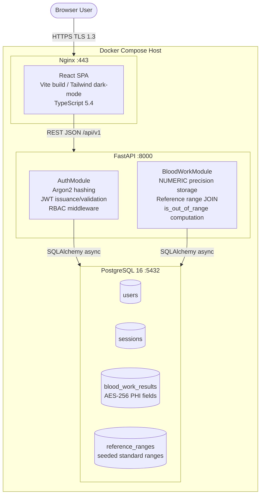
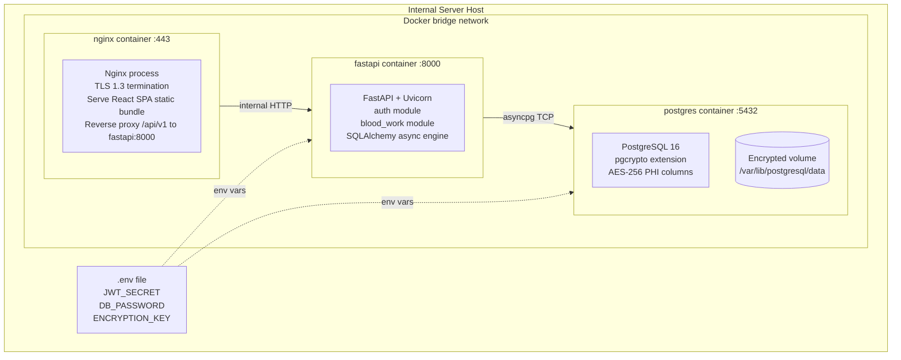
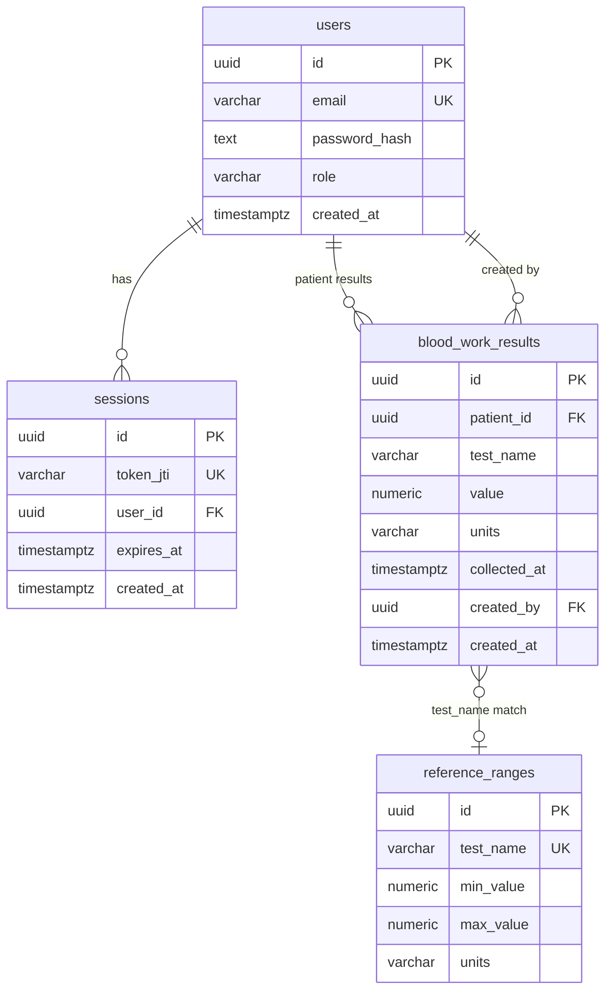
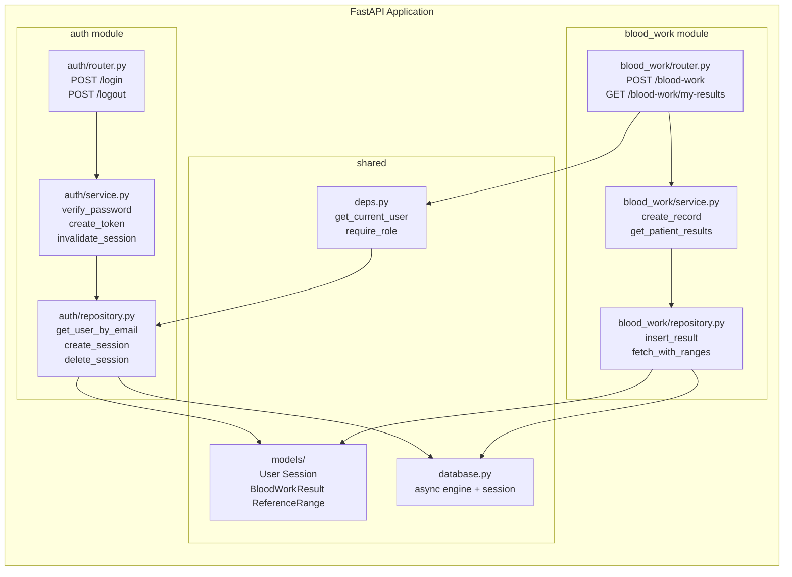
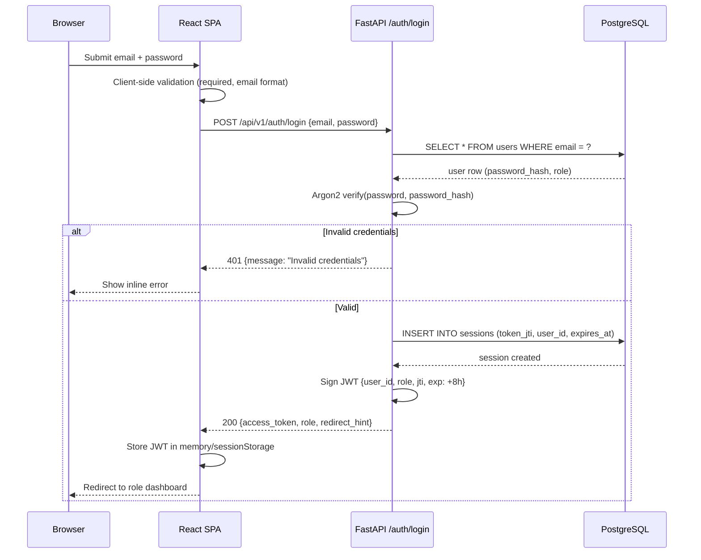
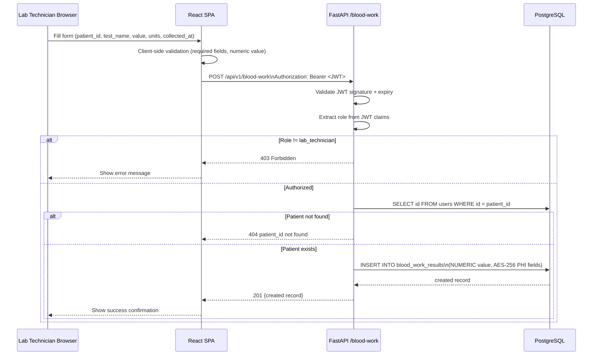
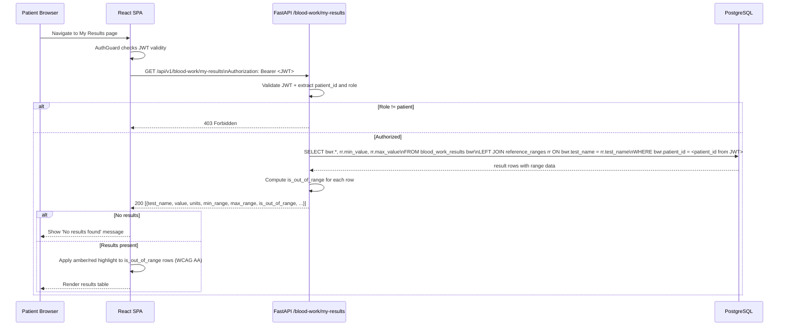
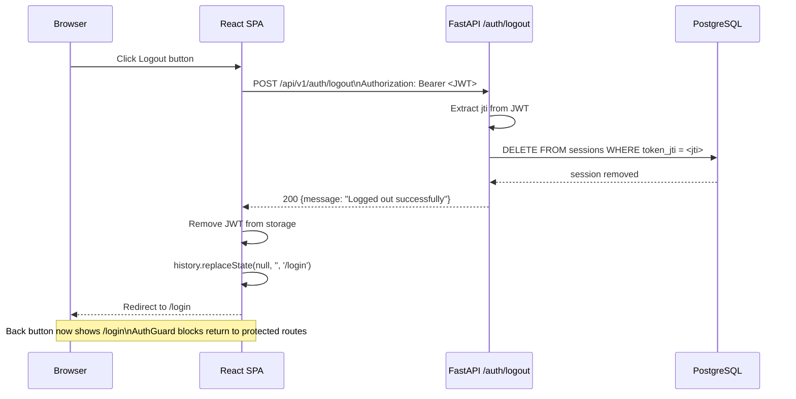
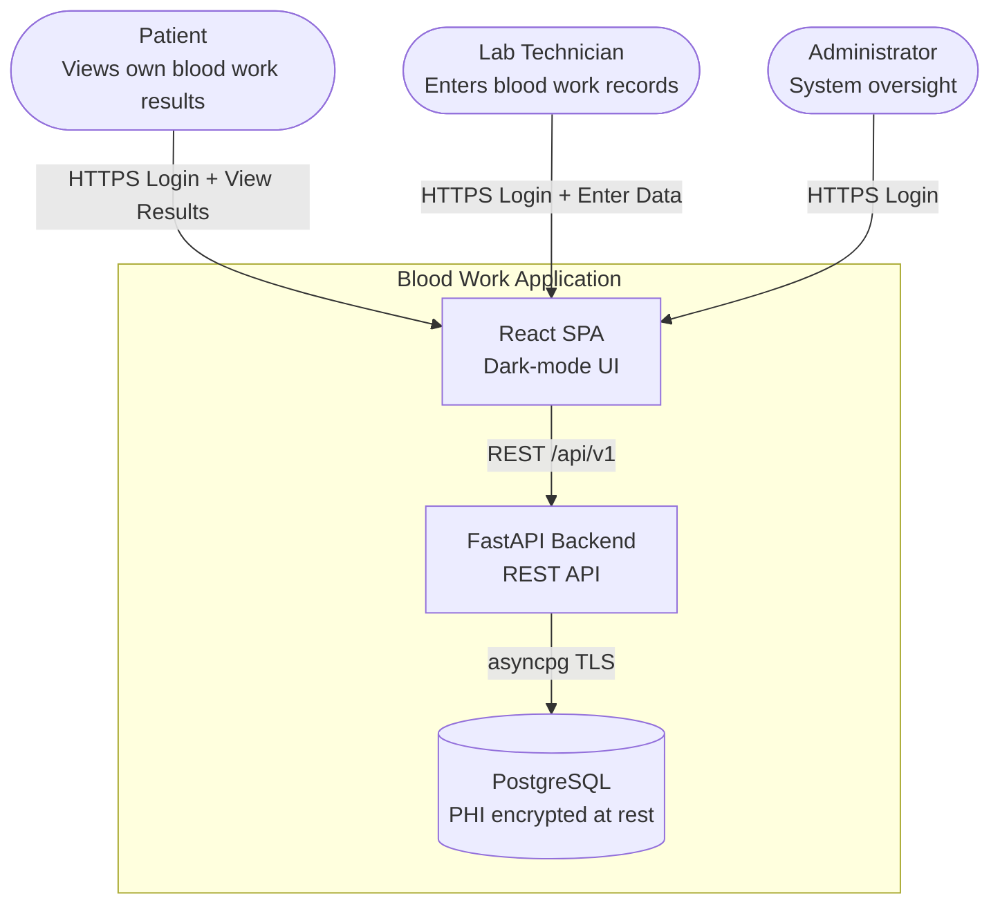

# Architecture Diagrams — lab-results-dashboard

> Generated by Elite AI Pod's Solution Architect agent on 2026-08-10T11:37+00:00.
> Mermaid diagrams render natively on GitHub.

## Blood Work System — C4 Container Diagram

Details the three containers: React SPA (Nginx-served static bundle), FastAPI backend (modular monolith with Auth and BloodWork modules), and PostgreSQL database with AES-256 encrypted PHI columns. All traffic uses TLS 1.3.

## Blood Work Data Flow — End to End

Traces blood work data from Lab Technician form submission through API validation and encrypted storage, then through the patient results query that joins reference ranges and computes out-of-range flags, to the conditional-formatted table rendered in the patient's browser.

```mermaid
flowchart LR
    LT[Lab Technician\nForm Input] -->|POST /api/v1/blood-work\npatient_id, test_name, value, units, collected_at| Validate
    Validate[FastAPI\nRBAC check\nField validation\nNumeric precision check] -->|valid| Encrypt
    Encrypt[SQLAlchemy TypeDecorator\nAES-256 encrypt patient_id + value] -->|INSERT NUMERIC| DB[(blood_work_results\nPostgreSQL)]
    DB -->|SELECT with JOIN| Query
    Query[FastAPI\nGET /api/v1/blood-work/my-results\nPatient RBAC check\nJOIN reference_ranges on test_name\nCompute is_out_of_range] -->|decrypt PHI| Decrypt
    Decrypt[SQLAlchemy TypeDecorator\nAES-256 decrypt value] -->|JSON array| SPA
    SPA[React SPA\nRender results table\nAmber/red highlight if is_out_of_range\nWCAG AA contrast] --> Patient[Patient Browser]
```

## Docker Compose Deployment Topology

Shows the single-host Docker Compose deployment with Nginx as TLS termination and SPA server, FastAPI backend container, and PostgreSQL container with encrypted volume. All inter-container traffic on internal Docker bridge network.

## Entity-Relationship Diagram

Shows the four database tables: users (with role enum), sessions (server-side JWT denylist), blood_work_results (NUMERIC values, PHI encrypted), and reference_ranges (seeded clinical reference data). Patient results query joins blood_work_results to reference_ranges on test_name.

## FastAPI Internal Module Boundaries

Shows how the FastAPI modular monolith is structured internally: router layer delegates to service layer, service layer calls repository layer, repository layer uses SQLAlchemy models. AuthModule provides a shared JWT dependency injected into BloodWorkModule routes.

## Sequence Diagrams

### User Login Flow

Shows the complete login sequence from form submission through credential validation, Argon2 verification, session creation, JWT issuance, and role-based redirect hint returned to the SPA.

### Lab Technician Submits Blood Work Record

Illustrates the data entry flow from Lab Technician form submission through RBAC validation, numeric precision storage, and success/error feedback. Covers US-005 and US-006.

### Patient Views Blood Work Results

Shows the patient results retrieval flow including JWT role enforcement, JOIN with reference_ranges for out-of-range computation, and conditional formatting applied by the SPA.

### User Logout with Back-Navigation Prevention

Covers the secure logout flow including server-side session invalidation, JWT removal from client storage, SPA redirect to login, and history.replaceState to prevent back-navigation to authenticated pages.

## Blood Work System — C4 Context Diagram

Shows the three user roles (Patient, Lab Technician, Administrator) interacting with the Blood Work Web Application, which stores PHI in the PostgreSQL database. No external system integrations in scope for this prototype.

